# DB仕様書 (Database Design Document)

## 概要

BentoSales のデータベースは SQLite（開発・ローカル運用）または Turso（Vercel 運用）を使用し、Prisma ORM で管理する。

- **スキーマ定義**: `prisma/schema.prisma`
- **マイグレーション**: `prisma/migrations/`
- **初期データ**: `prisma/seed.ts`

---

## ER図

```mermaid
erDiagram
    Customer {
        String id PK
        String name UK
        String phoneNumber
        String address
        String contactName
        String notes
        String taxType
        String paymentMethod
        String billingType
        Int    billingDay
        Boolean isActive
        DateTime createdAt
        DateTime updatedAt
    }

    Product {
        String id PK
        String name UK
        Int    basePrice
        Float  taxRate
        Boolean isActive
        DateTime createdAt
        DateTime updatedAt
    }

    CustomerProductPrice {
        String id PK
        String customerId FK
        String productId  FK
        Int    price
        DateTime createdAt
        DateTime updatedAt
    }

    Order {
        String id PK
        String customerId  FK
        String invoiceId   FK
        DateTime deliveryDate
        String notes
        Int    subtotal
        Int    taxAmount
        Int    totalAmount
        DateTime createdAt
        DateTime updatedAt
    }

    OrderItem {
        String id PK
        String orderId    FK
        String productId  FK
        String productName
        Int    unitPrice
        Int    quantity
        Float  taxRate
        String taxType
        Int    taxAmount
        Int    lineTotal
        DateTime createdAt
        DateTime updatedAt
    }

    Invoice {
        String id PK
        String invoiceNumber UK
        String customerId FK
        DateTime billingPeriodFrom
        DateTime billingPeriodTo
        DateTime issueDate
        DateTime dueDate
        Int    subtotal
        Int    taxAmount
        Int    totalAmount
        String status
        String notes
        String qualifiedInvoiceNumber
        DateTime createdAt
        DateTime updatedAt
    }

    InvoiceItem {
        String id PK
        String invoiceId   FK
        String orderId     FK
        String orderItemId FK
        String description
        Int    quantity
        Int    unitPrice
        Float  taxRate
        Int    taxAmount
        Int    lineTotal
        DateTime createdAt
    }

    Payment {
        String id PK
        String customerId FK
        Int    amount
        DateTime paidAt
        String paymentMethod
        String notes
        DateTime createdAt
    }

    DeliveryNote {
        String id PK
        String deliveryNoteNumber UK
        String orderId FK
        DateTime issueDate
        DateTime createdAt
    }

    User {
        String id PK
        String name
        String username UK
        String passwordHash
        String role
        Boolean isActive
        DateTime createdAt
        DateTime updatedAt
    }

    SystemSettings {
        String id PK
        String storeName
        String storeAddress
        String storePhone
        String qualifiedInvoiceNumber
        DateTime updatedAt
    }

    SequenceNumber {
        String id PK
        String type
        String yearMonth
        Int    lastNumber
        DateTime updatedAt
    }

    Customer    ||--o{ Order                 : "発注する"
    Customer    ||--o{ CustomerProductPrice  : "個別単価を持つ"
    Customer    ||--o{ Invoice               : "請求される"
    Customer    ||--o{ Payment               : "入金を受ける"
    Product     ||--o{ OrderItem             : "注文明細に含まれる"
    Product     ||--o{ CustomerProductPrice  : "個別単価を持つ"
    Order       ||--o{ OrderItem             : "明細を含む"
    Order       ||--o{ InvoiceItem           : "請求明細になる"
    Order       |o--|| DeliveryNote          : "納品書を持つ"
    Order       }o--o| Invoice               : "請求書にまとめられる"
    OrderItem   ||--o{ InvoiceItem           : "請求明細になる"
    Invoice     ||--o{ InvoiceItem           : "明細を含む"
```

---

## テーブル定義

### User（ユーザー）

アプリの操作ユーザー。STAFF / OWNER の2ロールを持つ。

| カラム | 型 | 制約 | 説明 |
|--------|-----|------|------|
| id | String | PK, UUID | 主キー |
| name | String | NOT NULL | 表示名 |
| username | String | UNIQUE | ログイン名 |
| passwordHash | String | NOT NULL | bcrypt ハッシュ |
| role | String | NOT NULL | `STAFF` \| `OWNER` |
| isActive | Boolean | DEFAULT true | 有効/無効フラグ |
| createdAt | DateTime | DEFAULT now() | 作成日時 |
| updatedAt | DateTime | 自動更新 | 更新日時 |

---

### Customer（顧客）

弁当を注文する取引先。請求・支払い条件も顧客単位で管理する。

| カラム | 型 | 制約 | 説明 |
|--------|-----|------|------|
| id | String | PK, UUID | 主キー |
| name | String | UNIQUE | 顧客名 |
| phoneNumber | String? | | 電話番号 |
| address | String? | | 住所 |
| contactName | String? | | 担当者名 |
| notes | String? | | 備考 |
| taxType | String | NOT NULL | `EXCLUSIVE`（外税）\| `INCLUSIVE`（内税） |
| paymentMethod | String | NOT NULL | `CASH` \| `TRANSFER` \| `AUTO_DEBIT` \| `OTHER` |
| billingType | String | NOT NULL | `PER_ORDER`（都度）\| `MONTHLY`（月締め）\| `SPECIFIED_DAY`（指定日締め） |
| billingDay | Int? | | 締め日（billingType = `SPECIFIED_DAY` のとき使用） |
| isActive | Boolean | DEFAULT true | 有効/無効フラグ |
| createdAt | DateTime | DEFAULT now() | 作成日時 |
| updatedAt | DateTime | 自動更新 | 更新日時 |

---

### Product（商品）

販売する弁当等の商品。基本単価と税率を持つ。

| カラム | 型 | 制約 | 説明 |
|--------|-----|------|------|
| id | String | PK, UUID | 主キー |
| name | String | UNIQUE | 商品名 |
| basePrice | Int | NOT NULL | 基本単価（円、税抜） |
| taxRate | Float | NOT NULL | 税率（例: 0.08 / 0.10） |
| isActive | Boolean | DEFAULT true | 有効/無効フラグ |
| createdAt | DateTime | DEFAULT now() | 作成日時 |
| updatedAt | DateTime | 自動更新 | 更新日時 |

---

### CustomerProductPrice（顧客別商品単価）

顧客ごとに設定する商品の個別単価。存在する場合、商品の基本単価より優先される。

| カラム | 型 | 制約 | 説明 |
|--------|-----|------|------|
| id | String | PK, UUID | 主キー |
| customerId | String | FK → Customer.id | 顧客 |
| productId | String | FK → Product.id | 商品 |
| price | Int | NOT NULL | 個別単価（円） |
| createdAt | DateTime | DEFAULT now() | 作成日時 |
| updatedAt | DateTime | 自動更新 | 更新日時 |

**複合ユニーク制約**: `(customerId, productId)`

---

### Order（注文）

1顧客1日1注文を基本単位とする注文ヘッダー。複数の OrderItem を持つ。

| カラム | 型 | 制約 | 説明 |
|--------|-----|------|------|
| id | String | PK, UUID | 主キー |
| customerId | String | FK → Customer.id | 顧客 |
| deliveryDate | DateTime | NOT NULL, INDEX | 納品日 |
| notes | String? | | 備考 |
| subtotal | Int | NOT NULL | 小計（税抜合計） |
| taxAmount | Int | NOT NULL | 消費税合計 |
| totalAmount | Int | NOT NULL | 税込合計 |
| invoiceId | String? | FK → Invoice.id, INDEX | 請求書（請求済みの場合のみ設定） |
| createdAt | DateTime | DEFAULT now() | 作成日時 |
| updatedAt | DateTime | 自動更新 | 更新日時 |

**インデックス**: `deliveryDate`, `customerId`, `invoiceId`

---

### OrderItem（注文明細）

注文の商品明細。1注文に複数の商品行が入る。

| カラム | 型 | 制約 | 説明 |
|--------|-----|------|------|
| id | String | PK, UUID | 主キー |
| orderId | String | FK → Order.id (CASCADE), INDEX | 注文 |
| productId | String | FK → Product.id | 商品 |
| productName | String | NOT NULL | 商品名スナップショット（商品変更後も保持） |
| unitPrice | Int | NOT NULL | 単価スナップショット |
| quantity | Int | NOT NULL | 数量 |
| taxRate | Float | NOT NULL | 税率スナップショット |
| taxType | String | NOT NULL | `EXCLUSIVE` \| `INCLUSIVE` |
| taxAmount | Int | NOT NULL | 消費税額 |
| lineTotal | Int | NOT NULL | 行合計（税込） |
| createdAt | DateTime | DEFAULT now() | 作成日時 |
| updatedAt | DateTime | 自動更新 | 更新日時 |

**インデックス**: `orderId`
**削除ルール**: Order 削除時に Cascade 削除

---

### Invoice（請求書）

顧客への請求書ヘッダー。複数の Order をまとめて発行する。

| カラム | 型 | 制約 | 説明 |
|--------|-----|------|------|
| id | String | PK, UUID | 主キー |
| invoiceNumber | String | UNIQUE | 請求書番号（例: `INV-202506-0001`） |
| customerId | String | FK → Customer.id, INDEX | 顧客 |
| billingPeriodFrom | DateTime | NOT NULL | 請求対象期間（開始） |
| billingPeriodTo | DateTime | NOT NULL | 請求対象期間（終了） |
| issueDate | DateTime | NOT NULL | 発行日 |
| dueDate | DateTime? | | 支払期限 |
| subtotal | Int | NOT NULL | 小計（税抜合計） |
| taxAmount | Int | NOT NULL | 消費税合計 |
| totalAmount | Int | NOT NULL | 税込合計 |
| status | String | NOT NULL, INDEX | `DRAFT` \| `ISSUED` \| `CANCELLED` |
| notes | String? | | 備考 |
| qualifiedInvoiceNumber | String? | | 適格請求書発行事業者登録番号（発行時スナップショット） |
| createdAt | DateTime | DEFAULT now() | 作成日時 |
| updatedAt | DateTime | 自動更新 | 更新日時 |

**インデックス**: `(customerId, status)`, `status`

---

### InvoiceItem（請求明細）

請求書の明細行。OrderItem を元に生成するが、請求書発行時点のスナップショットとして保持する。

| カラム | 型 | 制約 | 説明 |
|--------|-----|------|------|
| id | String | PK, UUID | 主キー |
| invoiceId | String | FK → Invoice.id | 請求書 |
| orderId | String | FK → Order.id | 元注文 |
| orderItemId | String | FK → OrderItem.id | 元注文明細 |
| description | String | NOT NULL | 品目説明（表示用） |
| quantity | Int | NOT NULL | 数量 |
| unitPrice | Int | NOT NULL | 単価 |
| taxRate | Float | NOT NULL | 税率 |
| taxAmount | Int | NOT NULL | 消費税額 |
| lineTotal | Int | NOT NULL | 行合計（税込） |
| createdAt | DateTime | DEFAULT now() | 作成日時 |

---

### Payment（入金）

顧客単位の入金記録。1回の入金操作につき1レコード。特定の Invoice への紐づけは行わず、顧客全体の残高管理で使用する。

| カラム | 型 | 制約 | 説明 |
|--------|-----|------|------|
| id | String | PK, UUID | 主キー |
| customerId | String | FK → Customer.id | 入金顧客 |
| amount | Int | NOT NULL | 入金額（円） |
| paidAt | DateTime | NOT NULL | 入金日時 |
| paymentMethod | String | NOT NULL | `CASH` \| `TRANSFER` \| `AUTO_DEBIT` \| `OTHER` |
| notes | String? | | 備考 |
| createdAt | DateTime | DEFAULT now() | 作成日時 |

---

### DeliveryNote（納品書）

注文1件に対して1枚発行される納品書。帳票番号と発行日を管理する。

| カラム | 型 | 制約 | 説明 |
|--------|-----|------|------|
| id | String | PK, UUID | 主キー |
| deliveryNoteNumber | String | UNIQUE | 納品書番号（例: `DEL-202506-0001`） |
| orderId | String | UNIQUE, FK → Order.id, INDEX | 元注文（1対1） |
| issueDate | DateTime | NOT NULL | 発行日 |
| createdAt | DateTime | DEFAULT now() | 作成日時 |

---

### SystemSettings（システム設定）

店舗情報やシステム設定を管理するシングルトンテーブル。常に `id = 'default'` の1レコードのみ存在する。

| カラム | 型 | 制約 | 説明 |
|--------|-----|------|------|
| id | String | PK | 常に `'default'` |
| storeName | String | DEFAULT "BentoSales" | 店舗名 |
| storeAddress | String? | | 店舗住所 |
| storePhone | String? | | 店舗電話番号 |
| qualifiedInvoiceNumber | String? | | 適格請求書発行事業者登録番号（T + 13桁） |
| updatedAt | DateTime | 自動更新 | 更新日時 |

---

### SequenceNumber（採番管理）

帳票番号の連番を管理する。月・帳票種別ごとに採番する。

| カラム | 型 | 制約 | 説明 |
|--------|-----|------|------|
| id | String | PK, UUID | 主キー |
| type | String | NOT NULL | `INVOICE` \| `RECEIPT` \| `DELIVERY_NOTE` |
| yearMonth | String | NOT NULL | 年月（例: `202506`） |
| lastNumber | Int | DEFAULT 0 | 最終採番番号 |
| updatedAt | DateTime | 自動更新 | 更新日時 |

**複合ユニーク制約**: `(type, yearMonth)`
**採番ルール**: Prisma トランザクション内で `lastNumber` をインクリメントし、競合を防止する（詳細は `architecture.md` 参照）

---

## 列挙型の値一覧

### taxType（課税方式）

| 値 | 意味 |
|----|------|
| `EXCLUSIVE` | 外税（税抜価格に税額を加算） |
| `INCLUSIVE` | 内税（税込価格から税額を逆算） |

### paymentMethod（支払い方法）

| 値 | 意味 |
|----|------|
| `CASH` | 現金 |
| `TRANSFER` | 銀行振込 |
| `AUTO_DEBIT` | 口座振替 |
| `OTHER` | その他 |

### billingType（請求タイプ）

| 値 | 意味 |
|----|------|
| `PER_ORDER` | 都度請求（注文ごとに請求書発行） |
| `MONTHLY` | 月締め（月末に一括請求） |
| `SPECIFIED_DAY` | 指定日締め（`billingDay` カラムの日で締め） |

### Invoice.status（請求書ステータス）

入金状態は Invoice 個別に追跡しない。残高管理は顧客単位（売掛金元帳）で行う。

| 値 | 意味 | 遷移先 |
|----|------|--------|
| `DRAFT` | 下書き | `ISSUED` |
| `ISSUED` | 発行済み | `CANCELLED` |
| `CANCELLED` | キャンセル | （終端） |

### User.role（ユーザーロール）

| 値 | 権限 |
|----|------|
| `STAFF` | 注文入力・注文一覧・製造一覧・納品書PDF出力 |
| `OWNER` | 全機能（顧客管理・商品管理・請求・設定・ユーザー管理含む） |

### SequenceNumber.type（帳票種別）

| 値 | 帳票 | プレフィックス例 |
|----|------|----------------|
| `INVOICE` | 請求書 | `INV-202506-0001` |
| `RECEIPT` | 領収書 | `REC-202506-0001` |
| `DELIVERY_NOTE` | 納品書 | `DEL-202506-0001` |

---

## 設計上の注意点

### スナップショット保存

OrderItem の `productName`, `unitPrice`, `taxRate` は注文時点の値をそのまま保存する。商品マスタを後から変更しても過去の注文内容は変わらない。同様に `Invoice.qualifiedInvoiceNumber` も発行時点の登録番号をスナップショット保存する。

### 採番の排他制御

`SequenceNumber` への書き込みは必ず Prisma トランザクション (`$transaction`) 内で行う。SQLite は `SERIALIZABLE` 相当のトランザクション分離レベルを使用するため、同時採番での重複は発生しない。

### Order と Invoice の関係

- `Order.invoiceId` は請求書発行前は `null`
- 請求書キャンセル時は `Order.invoiceId` を `null` に戻す（未請求状態に復帰）
- 1つの請求書には複数の注文が紐づく（`Invoice ||--o{ Order`）

### Payment と Invoice の関係

- `Payment` は顧客単位（`customerId`）で記録する。特定の Invoice への紐づけは行わない
- 顧客の未回収残高 = `Σ Invoice.totalAmount (status = ISSUED)` − `Σ Payment.amount`
- Invoice の `status` は `ISSUED` / `CANCELLED` のみ。入金によって自動更新されない
- 入金状況は売掛金元帳（`/payments/customers/[customerId]`）で時系列表示する
