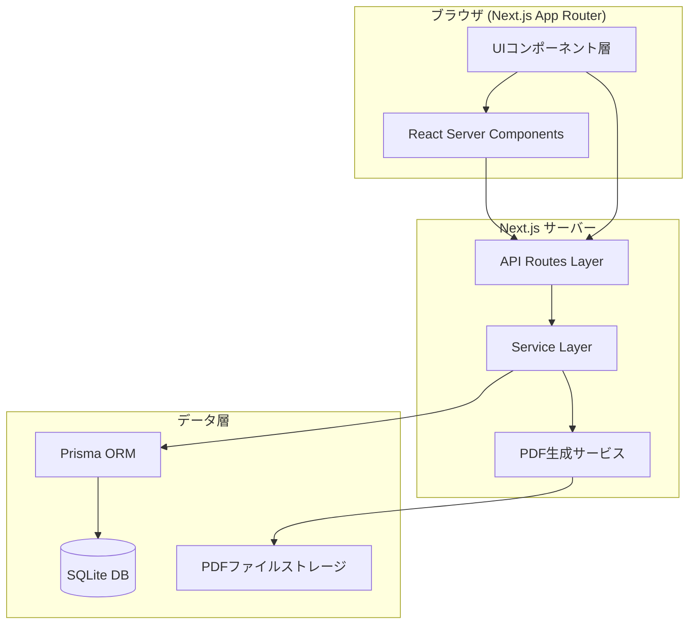
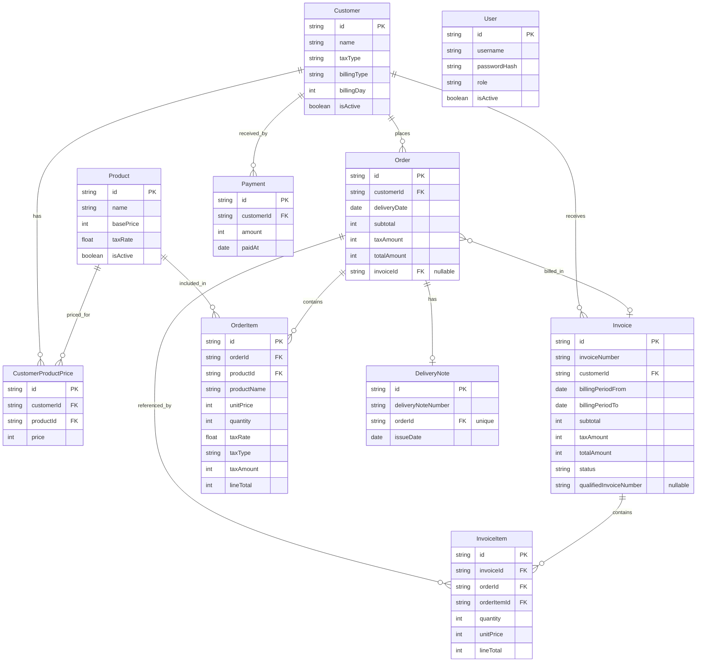
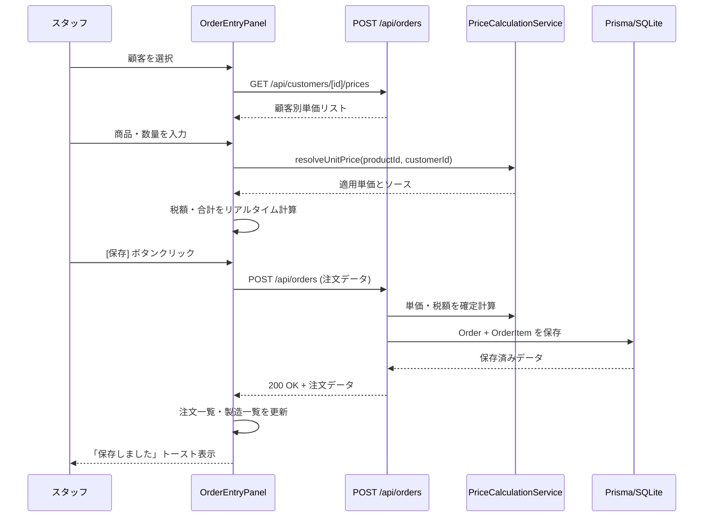
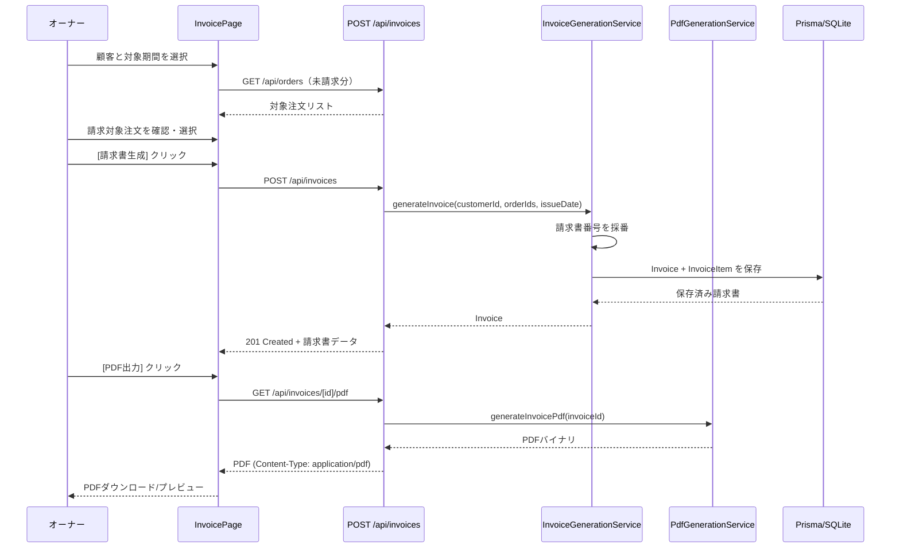
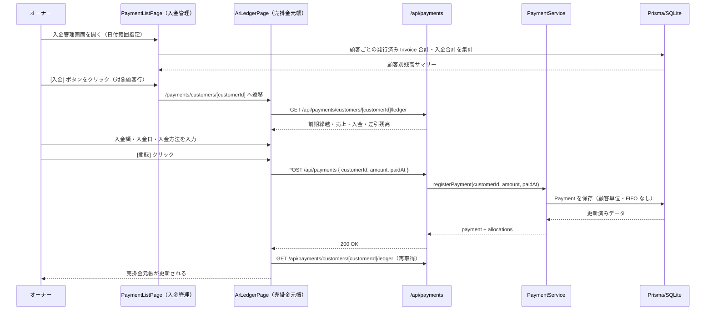
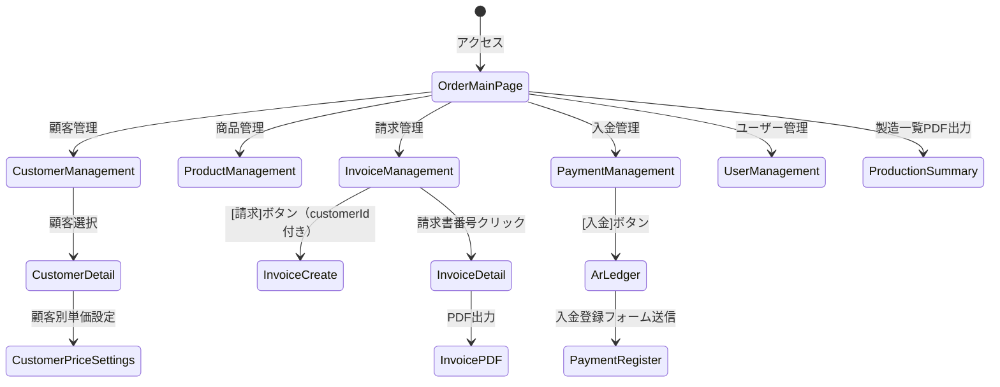

# 機能設計書 (Functional Design Document)

## システム構成図



---

## 技術スタック

| 分類 | 技術 | 選定理由 |
|------|------|----------|
| フレームワーク | Next.js 15 (App Router) | SSR/SSG・API Routes・React Server Components が一体化。単一プロセスで完結 |
| 言語 | TypeScript 5.x | 型安全性による開発ミス防止。複雑な価格・税計算ロジックの信頼性を向上 |
| UIライブラリ | React 19 | Next.js と統合。Server Components によるサーバーサイドレンダリング |
| CSSフレームワーク | Tailwind CSS | ユーティリティファーストでUIを高速構築 |
| UIコンポーネント | shadcn/ui | アクセシブルで再利用可能なコンポーネント群 |
| データグリッド | TanStack Table | 注文一覧のインライン編集・ソート・フィルタ対応 |
| ORM | Prisma | 型安全なDB操作。マイグレーション管理が容易 |
| データベース | SQLite | 単店舗向けシングルプロセス運用に最適。セットアップ不要 |
| PDF生成 | @react-pdf/renderer | Reactコンポーネントで帳票レイアウトを定義可能 |
| バリデーション | Zod | フォームとAPIの両方で型安全なバリデーション |
| 状態管理 | Zustand | グローバル状態（選択日付・注文リスト）の軽量管理 |

---

## データモデル定義

### エンティティ: Customer（顧客）

```typescript
interface Customer {
  id: string;                      // UUID
  name: string;                    // 顧客名（1-100文字）
  phoneNumber?: string;            // 電話番号
  address?: string;                // 住所
  contactName?: string;            // 担当者名
  notes?: string;                  // 備考
  taxType: TaxType;                // 税区分（外税 | 内税）
  paymentMethod: PaymentMethod;    // 支払方法
  billingType: BillingType;        // 締め種別（都度 | 月締め | 指定日締め）
  billingDay?: number;             // 締め日（1-31、月締め・指定日締めの場合）
  isActive: boolean;               // 有効/無効フラグ
  createdAt: Date;
  updatedAt: Date;
}

type TaxType = 'EXCLUSIVE' | 'INCLUSIVE';  // 外税 | 内税
type PaymentMethod = 'CASH' | 'TRANSFER' | 'AUTO_DEBIT' | 'OTHER';
type BillingType = 'PER_ORDER' | 'MONTHLY' | 'SPECIFIED_DAY';
```

**制約**:
- `name` は必須、重複不可
- `billingDay` は `MONTHLY` または `SPECIFIED_DAY` の場合のみ有効（1-31）

---

### エンティティ: Product（商品）

```typescript
interface Product {
  id: string;                      // UUID
  name: string;                    // 商品名（1-100文字）
  basePrice: number;               // 標準単価（0以上の整数、円）
  taxRate: number;                 // 税率（0.08 | 0.10）
  isActive: boolean;               // 有効/無効フラグ
  createdAt: Date;
  updatedAt: Date;
}
```

**制約**:
- `name` は必須、重複不可
- `basePrice` は0以上の整数
- `taxRate` は 0.08 または 0.10

---

### エンティティ: CustomerProductPrice（顧客別単価）

```typescript
interface CustomerProductPrice {
  id: string;
  customerId: string;              // FK: Customer
  productId: string;               // FK: Product
  price: number;                   // 顧客別単価（0以上の整数、円）
  createdAt: Date;
  updatedAt: Date;
}
```

**制約**:
- `customerId` + `productId` の複合ユニーク制約

---

### エンティティ: Order（注文）

```typescript
interface Order {
  id: string;                      // UUID
  customerId: string;              // FK: Customer
  deliveryDate: Date;              // 配送日（注文対象日）
  notes?: string;                  // 備考
  subtotal: number;                // 税抜合計（円）
  taxAmount: number;               // 消費税額（円）
  totalAmount: number;             // 税込合計（円）
  invoiceId: string | null;        // 紐づく請求書のFK（未請求: null、請求済み: Invoice.id）
  createdAt: Date;
  updatedAt: Date;
}
```

---

### エンティティ: OrderItem（注文明細）

```typescript
interface OrderItem {
  id: string;                      // UUID
  orderId: string;                 // FK: Order
  productId: string;               // FK: Product
  productName: string;             // 商品名（注文時点でスナップショット）
  unitPrice: number;               // 単価（注文時点で確定）
  quantity: number;                // 数量（1以上の整数）
  taxRate: number;                 // 税率（注文時点で確定）
  taxType: TaxType;                // 税区分（顧客設定から継承・確定）
  taxAmount: number;               // 税額（注文時点で計算・確定）
  lineTotal: number;               // 税抜行合計（unitPrice × quantity）。税込合計は lineTotal + taxAmount で導出
  createdAt: Date;
  updatedAt: Date;
}
```

**制約**:
- `unitPrice`・`taxRate`・`taxType`・`taxAmount` は注文確定時に固定（後から商品マスタが変わっても影響しない）
- `quantity` は1以上の整数

---

### エンティティ: Invoice（請求書）

```typescript
interface Invoice {
  id: string;                      // UUID
  invoiceNumber: string;           // 請求書番号（INV-YYYYMM-NNNN）
  customerId: string;              // FK: Customer
  billingPeriodFrom: Date;         // 請求対象期間（開始）
  billingPeriodTo: Date;           // 請求対象期間（終了）
  issueDate: Date;                 // 発行日
  dueDate?: Date;                  // 支払期限
  subtotal: number;                // 税抜合計（円）
  taxAmount: number;               // 消費税額（円）
  totalAmount: number;             // 税込合計（円）
  status: InvoiceStatus;           // 請求書状態
  notes?: string;                  // 備考
  qualifiedInvoiceNumber?: string; // 適格請求書発行事業者登録番号（T+13桁、発行時にスナップショット保存）
  createdAt: Date;
  updatedAt: Date;
}

type InvoiceStatus = 'DRAFT' | 'ISSUED' | 'CANCELLED';
```

**制約**:
- `invoiceNumber` は自動採番、ユニーク
- 入金の有無は Customer 単位で `Σ Payment.amount` と `Σ Invoice.totalAmount` の差分で管理する（Invoice 個別には入金状態を持たない）

---

### エンティティ: InvoiceItem（請求明細）

```typescript
interface InvoiceItem {
  id: string;
  invoiceId: string;               // FK: Invoice
  orderId: string;                 // FK: Order（紐づく注文）
  orderItemId: string;             // FK: OrderItem
  description: string;             // 明細説明（商品名 + 配送日など）
  quantity: number;
  unitPrice: number;
  taxRate: number;
  taxAmount: number;
  lineTotal: number;
  createdAt: Date;
}
```

---

### エンティティ: Payment（入金）

```typescript
interface Payment {
  id: string;                      // UUID
  customerId: string;              // FK: Customer（顧客単位で入金を記録）
  amount: number;                  // 入金額（円）
  paidAt: Date;                    // 入金日
  paymentMethod: PaymentMethod;    // 入金方法
  notes?: string;                  // 備考
  createdAt: Date;
}
```

**制約**:
- 入金は顧客単位で記録し、特定の Invoice には紐づけない
- 顧客の未回収残高 = `Σ Invoice.totalAmount (status=ISSUED)` − `Σ Payment.amount`

---

### エンティティ: DeliveryNote（納品書）

```typescript
interface DeliveryNote {
  id: string;                      // UUID
  deliveryNoteNumber: string;      // 納品書番号（DEL-YYYYMM-NNNN）
  orderId: string;                 // FK: Order（1対1）
  issueDate: Date;                 // 発行日
  createdAt: Date;
}
```

**制約**:
- `orderId` はユニーク（1注文に1納品書のみ発行可能）
- `deliveryNoteNumber` は自動採番、ユニーク

---

### エンティティ: User（ユーザー）

```typescript
interface User {
  id: string;                      // UUID
  name: string;                    // 表示名
  username: string;                // ログインID（ユニーク）
  passwordHash: string;            // bcryptハッシュ
  role: UserRole;                  // ロール
  isActive: boolean;               // 有効/無効フラグ
  createdAt: Date;
  updatedAt: Date;
}

type UserRole = 'STAFF' | 'OWNER';
```

**ロール権限**:
| ロール | アクセス可能機能 |
|-------|----------------|
| STAFF | 注文入力・注文一覧・製造一覧の閲覧・納品書PDF出力・製造一覧PDF出力 |
| OWNER | 全機能（顧客管理・商品管理・請求管理・入金管理・全帳票出力） |

---

### エンティティ: SystemSettings（システム設定）

```typescript
interface SystemSettings {
  id: string;                         // 固定値 'default'（シングルトン）
  storeName: string;                  // 店舗名（帳票に印字）
  storeAddress?: string;              // 住所
  storePhone?: string;                // 電話番号
  qualifiedInvoiceNumber?: string;    // 適格請求書発行事業者登録番号（T+13桁）
  updatedAt: Date;
}
```

**制約**:
- レコードは常に1件のみ（`id = 'default'` のシングルトン）
- `qualifiedInvoiceNumber` が設定されている場合、請求書発行時に Invoice にスナップショット保存

---

### エンティティ: SequenceNumber（採番管理）

```typescript
interface SequenceNumber {
  id: string;
  type: DocumentType;              // 帳票種別
  yearMonth: string;               // YYYYMM
  lastNumber: number;              // 最後に発行した連番
  updatedAt: Date;
}

type DocumentType = 'INVOICE' | 'RECEIPT' | 'DELIVERY_NOTE';
```

---

### ER図



---

## コンポーネント設計

### UIレイヤー（React Components）

#### OrderEntryPanel（注文入力パネル）

**責務**:
- 顧客選択プルダウン
- 商品行の追加・削除
- 商品プルダウン・数量・単価の入力
- 小計・税額・税込合計のリアルタイム表示
- 前回注文コピーボタン
- 保存ボタン
- Tab/Enter によるフォーカス制御（顧客→商品→数量→単価→次行の順）
- 単価種別（MANUAL/CUSTOMER/BASE）に応じた色分け表示

**props**:
```typescript
interface OrderEntryPanelProps {
  customers: Customer[];
  products: Product[];
  selectedDate: Date;
  onOrderSaved: (order: Order) => void;
}
```

---

#### OrderListGrid（注文一覧グリッド）

**責務**:
- 指定日の注文一覧を表形式で表示
- 数量・単価のインライン編集（編集差分を内部 state として保持）
- グリッド専用「変更を保存」ボタン押下で変更を一括確定（セル移動では自動保存しない）
- 行の削除
- 顧客別合計の表示
- 注文の請求済み/未請求バッジ表示（`invoiceId` の有無で判定）

**props**:
```typescript
interface OrderListGridProps {
  orders: OrderWithItems[];
  selectedDate: Date;
  onSaveChanges: (changedOrders: OrderWithItems[]) => void; // 「変更を保存」ボタン押下時
  onOrderDeleted: (orderId: string) => void;
}
```

---

#### ProductionSummary（製造一覧パネル）

**責務**:
- 指定日の商品別合計数量を集計・表示
- PDF出力ボタン

---

### APIレイヤー（Next.js API Routes）

**API 共通ルール**:
- 全エンドポイントはログイン必須（未認証は 401）
- OWNER ロールは全APIにアクセス可能
- STAFF ロールはアクセス可能APIのみ記載（それ以外は 403）
- 顧客・商品は物理削除なし。`isActive = false` による論理削除のみ（PUT で有効/無効切替）

#### 注文 API

| メソッド | パス | 説明 | 必要ロール |
|---------|------|------|-----------|
| GET | `/api/orders?date=YYYY-MM-DD` | 指定日の注文一覧取得 | STAFF, OWNER |
| GET | `/api/orders?customerId=xxx&unbilled=true&from=YYYY-MM-DD&to=YYYY-MM-DD` | 未請求注文フィルタ取得（請求書生成用） | OWNER |
| POST | `/api/orders` | 注文新規作成 | STAFF, OWNER |
| PUT | `/api/orders/[id]` | 注文更新（一括）| STAFF, OWNER |
| DELETE | `/api/orders/[id]` | 注文削除 | STAFF, OWNER |
| GET | `/api/orders/[id]/previous` | 同顧客の直近注文取得（前回コピー用） | STAFF, OWNER |

#### 顧客 API

| メソッド | パス | 説明 | 必要ロール |
|---------|------|------|-----------|
| GET | `/api/customers` | 顧客一覧取得（有効顧客） | STAFF, OWNER |
| POST | `/api/customers` | 顧客新規作成 | OWNER |
| PUT | `/api/customers/[id]` | 顧客更新（有効/無効切替含む） | OWNER |
| GET | `/api/customers/[id]/prices` | 顧客別単価一覧取得 | OWNER |
| PUT | `/api/customers/[id]/prices` | 顧客別単価一括更新 | OWNER |

#### 商品 API

| メソッド | パス | 説明 | 必要ロール |
|---------|------|------|-----------|
| GET | `/api/products` | 商品一覧取得（有効商品） | STAFF, OWNER |
| POST | `/api/products` | 商品新規作成 | OWNER |
| PUT | `/api/products/[id]` | 商品更新（有効/無効切替含む） | OWNER |

#### 請求 API

| メソッド | パス | 説明 | 必要ロール |
|---------|------|------|-----------|
| GET | `/api/invoices` | 請求書一覧取得（ステータスフィルタ対応） | OWNER |
| GET | `/api/invoices/unbilled-summary` | 顧客別未請求注文サマリー取得（請求管理画面用） | OWNER |
| POST | `/api/invoices` | 請求書生成 | OWNER |
| PUT | `/api/invoices/[id]` | 請求書更新（ステータス変更など） | OWNER |
| POST | `/api/invoices/[id]/cancel` | 請求書キャンセル（対象注文を未請求に戻す） | OWNER |
| GET | `/api/invoices/[id]/pdf` | 請求書PDF生成・取得 | OWNER |

#### 入金 API

| メソッド | パス | 説明 | 必要ロール |
|---------|------|------|-----------|
| GET | `/api/payments/customers/[customerId]/ledger` | 顧客の売掛金元帳データ取得（`from`/`to` パラメータで日付範囲指定） | OWNER |
| POST | `/api/payments` | 入金登録（customerId ベース。Payment を顧客単位で記録） | OWNER |
| DELETE | `/api/payments/[id]` | 入金削除（Payment レコードを削除） | OWNER |
| GET | `/api/invoices/[id]/receipt-pdf` | 領収書PDF生成・取得 | OWNER |

#### 帳票 API

| メソッド | パス | 説明 | 必要ロール |
|---------|------|------|-----------|
| GET | `/api/orders/[id]/delivery-note-pdf` | 納品書PDF生成・取得 | STAFF, OWNER |
| GET | `/api/production-summary?date=YYYY-MM-DD` | 製造一覧（JSON集計データ）取得 | STAFF, OWNER |
| GET | `/api/production-summary/pdf?date=YYYY-MM-DD` | 製造一覧PDF生成・取得 | STAFF, OWNER |

#### 認証 API

| メソッド | パス | 説明 | 必要ロール |
|---------|------|------|-----------|
| POST | `/api/auth/signin` | ログイン | - |
| POST | `/api/auth/signout` | ログアウト | 認証済み |

#### システム設定 API

| メソッド | パス | 説明 | 必要ロール |
|---------|------|------|-----------|
| GET | `/api/settings` | システム設定取得 | OWNER |
| PUT | `/api/settings` | システム設定更新（店舗名・インボイス番号など） | OWNER |

#### ユーザー管理 API

| メソッド | パス | 説明 | 必要ロール |
|---------|------|------|-----------|
| GET | `/api/users` | ユーザー一覧取得 | OWNER |
| POST | `/api/users` | ユーザー新規作成 | OWNER |
| PUT | `/api/users/[id]` | ユーザー更新（有効/無効切替） | OWNER |
| PUT | `/api/users/me/password` | 自分のパスワード変更 | 認証済み全ロール |

---

### サービスレイヤー

#### PriceCalculationService（価格計算サービス）

**責務**: 注文入力時の単価決定・税額計算

```typescript
class PriceCalculationService {
  resolveUnitPrice(
    productId: string,
    customerId: string,
    manualPrice?: number
  ): { price: number; source: 'MANUAL' | 'CUSTOMER' | 'BASE' };

  calculateTax(
    unitPrice: number,
    quantity: number,
    taxRate: number,
    taxType: TaxType
  ): { subtotal: number; taxAmount: number; lineTotal: number };
}
```

**価格優先順位**:
```
1. manualPrice（手動入力）
2. CustomerProductPrice.price（顧客別単価）
3. Product.basePrice（商品標準単価）
```

**税額計算ロジック**:
```
外税 (EXCLUSIVE):
  lineTotal = unitPrice × quantity
  taxAmount = Math.floor(lineTotal × taxRate)
  totalWithTax = lineTotal + taxAmount

内税 (INCLUSIVE):
  lineTotal = unitPrice × quantity  ← 税込単価前提
  taxAmount = Math.floor(lineTotal - lineTotal / (1 + taxRate))
  subtotal = lineTotal - taxAmount
```

---

#### InvoiceGenerationService（請求書生成サービス）

**責務**: 顧客の締め条件に基づく請求対象注文の抽出と請求書生成

```typescript
class InvoiceGenerationService {
  getUnbilledOrders(
    customerId: string,
    upToDate: Date
  ): Order[];

  generateInvoice(
    customerId: string,
    orderIds: string[],
    issueDate: Date
  ): Invoice;

  /**
   * 請求書をキャンセルする。
   * Invoice.status を CANCELLED に更新し、紐づく全 Order.invoiceId を null に戻す。
   * トランザクション内で実行する。
   * @throws {BusinessError} 既に PAID の請求書はキャンセル不可
   */
  cancelInvoice(invoiceId: string): void;

  private generateInvoiceNumber(issueDate: Date): string;
}
```

**請求対象抽出ロジック**:
```
都度請求 (PER_ORDER):
  対象: 指定した注文のみ（手動選択）

月締め (MONTHLY):
  対象: 指定月の1日〜月末の未請求注文
  例: 5月請求 → 5/1〜5/31

指定日締め (SPECIFIED_DAY):
  対象: 前回締め日翌日〜今回締め日の未請求注文
  例: 締め日15日 → 4/16〜5/15
```

**採番ロジック**:
```
請求書: INV-YYYYMM-NNNN（例: INV-202605-0001）
領収書: REC-YYYYMM-NNNN
納品書: DEL-YYYYMM-NNNN
NNNN は月ごとにリセットする4桁連番
```

---

#### PaymentService（入金管理サービス）

**責務**: 顧客単位の入金登録・削除

```typescript
async function registerPayment(input: RegisterPaymentInput): Promise<void>;
async function deletePayment(paymentId: string): Promise<void>;
```

**残高計算**:
```
顧客の未回収残高 = Σ Invoice.totalAmount (status = ISSUED)
               − Σ Payment.amount
```

Invoice 個別の入金状態は持たない。売掛金元帳（`/payments/customers/[customerId]`）で顧客単位の残高を時系列表示する。

---

#### PdfGenerationService（PDF生成サービス）

**責務**: 各帳票のPDF生成と保存

```typescript
class PdfGenerationService {
  generateInvoicePdf(invoiceId: string): Promise<Buffer>;
  generateReceiptPdf(invoiceId: string): Promise<Buffer>;
  generateDeliveryNotePdf(orderId: string): Promise<Buffer>;
  generateProductionSummaryPdf(date: Date): Promise<Buffer>;
}
```

---

## ユースケースフロー

### UC-01: 電話注文受付〜注文保存



---

### UC-02: 請求書生成〜PDF出力



---

### UC-03: 入金登録〜売掛金元帳確認



---

## 画面構成・遷移図



### 主要画面一覧

| 画面名 | パス | 説明 |
|-------|------|------|
| 注文メイン | `/` | 注文入力 + 注文一覧 + 製造一覧の1画面完結 |
| 顧客一覧 | `/customers` | 顧客一覧・検索・新規登録 |
| 顧客詳細 | `/customers/[id]` | 顧客情報編集・顧客別単価設定 |
| 商品一覧 | `/products` | 商品一覧・新規登録・編集 |
| 請求管理 | `/invoices` | 顧客別未請求注文サマリー一覧・[請求]ボタン |
| 請求書詳細 | `/invoices/[id]` | 請求書詳細・PDF出力 |
| 請求書生成 | `/invoices/new` | 顧客・対象注文確認→請求書生成（customerId クエリで顧客・期間プリセット） |
| 入金管理 | `/payments` | 顧客別売掛金サマリー（発行日・入金日の期間・前期残高・期間発行額・期間入金額・残高・締め日）・[入金]ボタン |
| 売掛金元帳 | `/payments/customers/[customerId]` | 顧客の売掛金元帳（日付範囲指定・前期繰越・売上・入金・差引残高）・入金登録フォーム |
| ユーザー管理 | `/users` | ユーザー一覧・新規作成・有効/無効切替（OWNERのみ） |

---

## API設計（詳細）

### POST /api/orders

**リクエスト**:
```json
{
  "customerId": "uuid",
  "deliveryDate": "2026-05-08",
  "notes": "",
  "items": [
    {
      "productId": "uuid",
      "unitPrice": 800,
      "quantity": 10
    }
  ]
}
```

**レスポンス (201)**:
```json
{
  "id": "uuid",
  "customerId": "uuid",
  "deliveryDate": "2026-05-08",
  "subtotal": 8000,
  "taxAmount": 800,
  "totalAmount": 8800,
  "items": [...]
}
```

**エラー**:
- 400: バリデーションエラー（必須項目欠落、数量0以下など）
- 404: 顧客または商品が存在しない

---

### POST /api/invoices

**リクエスト**:
```json
{
  "customerId": "uuid",
  "orderIds": ["uuid1", "uuid2"],
  "issueDate": "2026-05-31",
  "dueDate": "2026-06-30",
  "notes": ""
}
```

**レスポンス (201)**:
```json
{
  "id": "uuid",
  "invoiceNumber": "INV-202605-0001",
  "customerId": "uuid",
  "totalAmount": 45000,
  "status": "ISSUED"
}
```

---

## ビジネスロジック

### 価格優先順位の適用

```typescript
function resolveUnitPrice(
  product: Product,
  customerPrices: CustomerProductPrice[],
  manualPrice?: number
): { price: number; source: PriceSource } {
  if (manualPrice !== undefined && manualPrice >= 0) {
    return { price: manualPrice, source: 'MANUAL' };
  }

  const customerPrice = customerPrices.find(
    (cp) => cp.productId === product.id
  );
  if (customerPrice) {
    return { price: customerPrice.price, source: 'CUSTOMER' };
  }

  return { price: product.basePrice, source: 'BASE' };
}
```

### 税額計算（円未満切り捨て）

```typescript
function calculateOrderItemTotals(
  unitPrice: number,
  quantity: number,
  taxRate: number,
  taxType: TaxType
): { subtotal: number; taxAmount: number; lineTotal: number } {
  const baseAmount = unitPrice * quantity;

  if (taxType === 'EXCLUSIVE') {
    const taxAmount = Math.floor(baseAmount * taxRate);
    return {
      subtotal: baseAmount,
      taxAmount,
      lineTotal: baseAmount + taxAmount,
    };
  } else {
    // INCLUSIVE: 単価が税込前提
    const taxAmount = Math.floor(baseAmount - baseAmount / (1 + taxRate));
    return {
      subtotal: baseAmount - taxAmount,
      taxAmount,
      lineTotal: baseAmount,
    };
  }
}
```

---

## UI設計

### 注文メイン画面レイアウト

```
┌─────────────────────────────────────────────────────────┐
│  BentoSales    [← 前日] 2026-05-08(木) [翌日 →]          │
│                [顧客管理] [商品管理] [請求管理]            │
├──────────────────────┬──────────────────────────────────┤
│  【注文入力】         │  【注文一覧】                       │
│                      │                                  │
│  顧客: [山田商事 ▼]   │  顧客名 | 商品    | 単価| 数量| 金額│
│                      │  ──────────────────────────────  │
│  ─────────────────   │  山田商事| 唐揚弁当| 800|  10| 8,000│
│  商品▼ |単価|数量|金額│  山田商事| 幕の内 | 900|   5| 4,500│
│  ─────────────────   │  ──────────────────────────────  │
│  唐揚弁当| 800| 10|   │  [山田商事合計: 12,500]           │
│  8,000               │                                  │
│  幕の内 | 900|  5|   │                                  │
│  4,500               │                                  │
│  ─────────────────   │                                  │
│  [+ 商品追加]        │                                  │
│                      ├──────────────────────────────────┤
│  税抜合計: 12,500     │  【製造一覧】                      │
│  消費税  :  1,250     │  唐揚げ弁当: 45個                  │
│  税込合計: 13,750     │  幕の内弁当: 32個                  │
│                      │  [製造一覧PDF出力]                │
│  [前回コピー] [保存]  │                                  │
└──────────────────────┴──────────────────────────────────┘
```

### 請求管理画面レイアウト（`/invoices`）

```
┌────────────────────────────────────────────────────────────────┐
│  請求管理                                                       │
├──────────────┬────────────────────┬──────┬──────────┬─────────┤
│ 顧客         │ 未請求期間          │ 件数 │ 合計金額  │         │
├──────────────┼────────────────────┼──────┼──────────┼─────────┤
│ (株)XYZ      │ 06/01 〜 06/30     │  3件 │ ¥84,000  │ [請求]  │
│ (株)PQR      │ 06/01 〜 06/30     │  2件 │ ¥140,000 │ [請求]  │
└──────────────┴────────────────────┴──────┴──────────┴─────────┘
```

- 未請求注文が0件の顧客は表示しない
- 未請求期間は顧客の `billingType` / `billingDay` から自動算出
- [請求] → `/invoices/new?customerId=xxx` へ遷移

### 入金管理画面レイアウト（`/payments`）

```
← [2026-06-01] 〜 [2026-06-30] →   [残高あり ▼]

発行日・入金日の期間：← [2026-06-01] 〜 [2026-06-30] →   [残高あり ▼]

┌──────────┬────────┬──────────┬────────────┬────────────┬──────────┬──────────┬────────┐
│ 顧客名   │ 締め日 │ 前期残高  │ 期間発行額  │ 期間入金額  │ 残高     │ ステータス│        │
├──────────┼────────┼──────────┼────────────┼────────────┼──────────┼──────────┼────────┤
│ (株)XYZ  │月末締め│   ¥0     │   ¥84,000  │      ¥0    │ ¥84,000  │ 未入金   │ [入金] │
│ (株)PQR  │15日締め│¥50,000   │  ¥140,000  │  ¥190,000  │    ¥0    │ 入金済み │ [詳細] │
└──────────┴────────┴──────────┴──────────┴──────────┴──────────┴──────────┴────────┘
```

- 顧客単位のサマリー表示（請求書単位ではない）
- **発行日・入金日の期間** で絞り込み。`←` / `→` で1ヶ月シフト、直接入力も可能
- **前期残高**: 期間開始前の累計残高（= Σ Invoice.totalAmount − Σ Payment.amount）
- **期間発行額**: 選択期間内に発行した Invoice の合計（Invoice.issueDate が期間内）
- **期間入金額**: 選択期間内に受けた Payment の合計（Payment.paidAt が期間内）
- **残高**: 前期残高 + 期間発行額 − 期間入金額
- **ステータス**: 全期間の累計残高で判断（未入金 / 一部入金 / 入金済み）
- 残高 > 0 の顧客に [入金]、残高 = 0 の顧客に [詳細]
- [入金] / [詳細] → `/payments/customers/[customerId]?from=...&to=...` へ遷移

### 売掛金元帳・入金処理画面レイアウト（`/payments/customers/[customerId]`）

```
(株)XYZ  売掛金元帳         ← [2026-06-01] 〜 [2026-06-30] →
┌────────────┬──────────────────────────┬──────────┬──────────┬──────────┐
│ 日付       │ 摘要                      │ 売上     │ 入金     │ 差引残高 │
├────────────┼──────────────────────────┼──────────┼──────────┼──────────┤
│            │ 前期繰越                  │          │          │ ¥105,000 │
│ 06/03      │ INV-202606-0001（5/7〜6/6）│ ¥84,000  │          │ ¥189,000 │
│ 06/05      │ 入金                      │          │ ¥105,000 │  ¥84,000 │
├────────────┼──────────────────────────┼──────────┼──────────┼──────────┤
│            │ 期末残高                  │          │          │  ¥84,000 │
└────────────┴──────────────────────────┴──────────┴──────────┴──────────┘

入金登録:  日付 [____]  金額 [________]  入金方法 [現金▼]  備考 [________]  [登録]
```

- 売上行 = 期間内に発行された Invoice（発行日・請求書番号・対象期間）
- 入金行 = 期間内の Payment（入金日・金額）、[削除] ボタン付き
- 差引残高 = 前期繰越 + 売上累計 − 入金累計
- 前期繰越 = 範囲開始前の `Σ Invoice.totalAmount − Σ Payment.amount`
- 日付範囲は `←` / `→` で変更可能（入金管理画面の選択範囲を引き継ぐ）

### カラーコーディング

| 用途 | 色 | 適用箇所 |
|-----|----|----|
| 入金済み | 緑 (green-600) | 入金管理ステータスバッジ・残高 |
| 未払い | 赤 (red-500) | 入金管理残高 |
| 顧客別単価適用中 | 青 (blue-500) | 単価フィールドの背景 |
| 手動単価入力中 | オレンジ (orange-400) | 単価フィールドの背景 |
| 標準単価適用中 | グレー (gray-400) | 単価フィールドの背景 |
| 請求済み注文 | 紫 (purple-500) | 注文一覧行の請求済みバッジ |
| 未請求注文 | デフォルト | バッジなし |

---

## エラーハンドリング

### エラーの分類

| エラー種別 | HTTP Status | ユーザーへの表示 |
|-----------|------------|-----------------|
| 入力バリデーションエラー | 400 | 該当フィールドにインラインエラーメッセージ表示 |
| リソース未発見 | 404 | 「指定されたデータが見つかりません」トースト |
| 重複データエラー | 409 | 「すでに同じ名称が存在します」トースト |
| DB保存エラー | 500 | 「保存に失敗しました。再度お試しください」トースト |
| PDF生成エラー | 500 | 「PDF生成に失敗しました」トースト |

### フロントエンドのエラー処理方針

- API通信エラー: React Query の `onError` コールバックでトースト表示
- フォームバリデーション: Zod スキーマで submit 前にクライアントサイドチェック
- ネットワーク断: 自動リトライ（3回）後にエラートースト

---

## テスト戦略

### ユニットテスト

- `PriceCalculationService.resolveUnitPrice`: 価格優先順位の3パターン
- `PriceCalculationService.calculateTax`: 外税・内税・端数処理の検証
- `InvoiceGenerationService.getUnbilledOrders`: 締め種別ごとの期間計算
- `PaymentService.updateInvoiceStatus`: ステータス遷移の全パターン
- 採番ロジック: 月跨ぎリセット・連番の正確性

### 統合テスト

- 注文作成〜注文一覧反映フロー
- 請求書生成〜InvoiceItem 作成の整合性検証
- 入金登録〜Invoice.status 自動更新

### E2Eテスト（Playwright）

- 電話注文入力〜保存〜製造一覧反映のフルフロー
- 請求書生成〜PDF出力フロー
- 入金登録〜領収書PDF出力フロー
