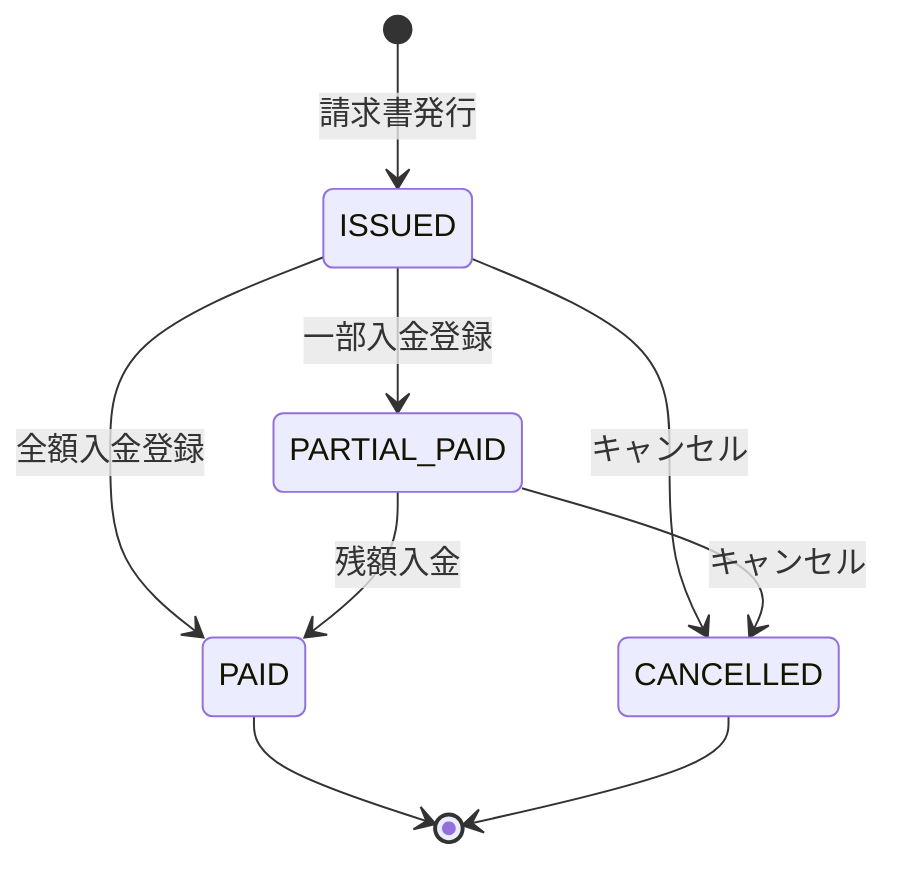

# プロジェクト用語集 (Glossary)

## 概要

このドキュメントは、BentoSales プロジェクト内で使用される業務用語・技術用語・略語を統一的に定義します。
コード・ドキュメント・コミュニケーションにおいて、ここで定義した用語を一貫して使用してください。

**更新日**: 2026-05-09

---

## ドメイン用語（業務用語）

仕出し弁当業務に固有のビジネス概念を定義します。

### 注文 (Order)

**定義**: 特定の顧客が特定の配送日に発注した弁当の集合

**説明**:
1顧客・1配送日につき1つの注文が作成される。注文には複数の注文明細（商品ごとの行）が含まれる。
注文が確定すると、その時点の単価・税率・税額が **不変** の状態で保存される。

**英語表記**: Order

**関連用語**: [注文明細](#注文明細-orderitem)、[顧客](#顧客-customer)、[配送日](#配送日)

**未請求 / 請求済みの判定**:
- `Order.invoiceId = null` → **未請求**（請求書生成の対象になる）
- `Order.invoiceId ≠ null` → **請求済み**（対応する `Invoice` が存在する）
- 請求書キャンセル時は紐づく全 `Order.invoiceId` が `null` に戻り、未請求状態に復帰する

**使用例**:
- 「山田商事から5月8日の注文を受けた」→ `Order` を1件作成
- 「注文を修正する」→ `Order` および `OrderItem` を更新

---

### 注文明細 (OrderItem)

**定義**: 注文に含まれる1商品分の行データ。商品・数量・単価・税額を保持する

**説明**:
注文確定時点の単価（`unitPrice`）・税率（`taxRate`）・税区分（`taxType`）・税額（`taxAmount`）をスナップショットとして固定保存する。
後から商品マスタの単価を変更しても、既存の注文明細に影響しない。

**英語表記**: OrderItem

**関連用語**: [注文](#注文-order)、[商品](#商品-product)、[価格優先順位](#価格優先順位)

---

### 顧客 (Customer)

**定義**: 弁当を発注する取引先。単価・税区分・締め条件などの取引条件を個別に保持する

**説明**:
顧客ごとに以下の取引条件を設定できる:
- [税区分](#税区分-taxtype)（外税 / 内税）
- [支払方法](#支払方法-paymentmethod)
- [締め種別](#締め種別-billingtype)・締め日

**英語表記**: Customer

**関連用語**: [顧客別単価](#顧客別単価-customerproductprice)、[締め種別](#締め種別-billingtype)、[税区分](#税区分-taxtype)

---

### 商品 (Product)

**定義**: 販売する弁当の品目。商品名・標準単価・税率・有効/無効フラグを持つ

**説明**:
- 無効（`isActive: false`）にした商品は注文入力の選択肢に表示されない
- 顧客別単価が設定されている場合、標準単価より顧客別単価が優先される（[価格優先順位](#価格優先順位)参照）

**英語表記**: Product

**関連用語**: [顧客別単価](#顧客別単価-customerproductprice)、[価格優先順位](#価格優先順位)

---

### 顧客別単価 (CustomerProductPrice)

**定義**: 特定の顧客に対して設定された商品ごとの個別単価

**説明**:
同じ商品でも顧客によって単価が異なる場合に設定する。
設定がない場合は商品の標準単価が適用される。

**英語表記**: CustomerProductPrice

**関連用語**: [価格優先順位](#価格優先順位)、[商品](#商品-product)、[顧客](#顧客-customer)

---

### 請求書 (Invoice)

**定義**: 特定の顧客に対して、一定期間の注文金額を請求する帳票

**説明**:
請求書は手動で生成する。顧客の[締め種別](#締め種別-billingtype)に応じて請求対象の注文が自動抽出される。
請求書番号は `INV-YYYYMM-NNNN` 形式で自動採番される。

**英語表記**: Invoice

**関連用語**: [請求明細](#請求明細-invoiceitem)、[入金](#入金-payment)、[締め種別](#締め種別-billingtype)、[採番](#採番)

**使用例**:
- 「5月分の請求書を発行する」→ 5月の未請求注文を集約して `Invoice` を生成し、PDFを出力

---

### 請求明細 (InvoiceItem)

**定義**: 請求書に含まれる1注文明細分の行データ

**英語表記**: InvoiceItem

**関連用語**: [請求書](#請求書-invoice)、[注文明細](#注文明細-orderitem)

---

### 入金 (Payment)

**定義**: 請求書に対して顧客から受け取った入金の記録

**説明**:
1件の請求書に対して複数回の入金登録が可能（分割入金対応）。
入金登録のたびに請求書の[入金ステータス](#請求書ステータス-invoicestatus)が自動更新される。

**英語表記**: Payment

**関連用語**: [請求書](#請求書-invoice)、[領収書](#領収書)、[売掛](#売掛-accounts-receivable)

---

### 売掛 (Accounts Receivable)

**定義**: 発行済みの請求書のうち、まだ入金が完了していない未回収金額の総称

**説明**:
`InvoiceStatus` が `ISSUED`（未払い）または `PARTIAL_PAID`（一部入金）の請求書の合計金額が売掛残高となる。

**英語表記**: Accounts Receivable / AR

**関連用語**: [請求書](#請求書-invoice)、[入金](#入金-payment)、[請求書ステータス](#請求書ステータス-invoicestatus)

---

### 帳票 (Document Form)

**定義**: 顧客への書類として発行するPDF書類の総称。請求書・領収書・納品書・製造一覧の4種類

**英語表記**: Document / Form

**種類**:

| 帳票名 | 採番形式 | 発行タイミング |
|------|---------|--------------|
| 請求書 | INV-YYYYMM-NNNN | 締め日到来後、手動生成 |
| 領収書 | REC-YYYYMM-NNNN | 入金済み確認後 |
| 納品書 | DEL-YYYYMM-NNNN | 配送時 |
| 製造一覧 | （採番なし） | 当日の製造確認用 |

---

### 納品書

**定義**: 注文の配送時に顧客へ渡す書類。注文内容・数量・金額を記載したもの

**英語表記**: Delivery Note

**採番**: `DEL-YYYYMM-NNNN`

**説明**: 1注文につき1納品書が生成される（1対1の関係）。`DeliveryNote.orderId` は `Order` への外部キーでユニーク制約を持つ。

**関連用語**: [注文](#注文-order)、[DeliveryNote](#deliverynote-納品書エンティティ)、[帳票](#帳票-document-form)

---

### 領収書

**定義**: 入金を受けたことを証明する書類。入金済みの請求書に対して発行する

**英語表記**: Receipt

**採番**: `REC-YYYYMM-NNNN`

---

### 製造一覧

**定義**: 指定日の全注文から商品ごとの合計数量を集計した一覧。厨房での製造数確認に使用する

**英語表記**: Production Summary

**説明**:
注文の追加・変更・削除に連動してリアルタイムに更新される。PDFとして出力して厨房に共有できる。

---

### 配送日

**定義**: 顧客への弁当配送予定日。注文の基準日として使用される

**英語表記**: Delivery Date

**説明**:
注文メイン画面では配送日ごとに注文一覧・製造一覧を切り替えて表示する。

---

### 税区分 (TaxType)

**定義**: 顧客との取引における消費税の計算方式。「外税」または「内税」の2種類

**英語表記**: TaxType

| 税区分 | 説明 | 計算方式 |
|-------|------|---------|
| 外税 (EXCLUSIVE) | 単価に税が含まれていない | `税額 = 単価 × 数量 × 税率`（切り捨て）|
| 内税 (INCLUSIVE) | 単価に税が含まれている | `税額 = 税込金額 - 税込金額 ÷ (1 + 税率)`（切り捨て）|

**関連用語**: [顧客](#顧客-customer)、[税額計算](#税額計算)

---

### 締め種別 (BillingType)

**定義**: 顧客ごとの請求書発行サイクルの種類

**英語表記**: BillingType

| 締め種別 | 説明 | 請求対象期間の例 |
|---------|------|--------------|
| 都度請求 (PER_ORDER) | 注文ごとに請求書を発行 | 特定注文のみ |
| 月締め (MONTHLY) | 月末締め | 当月1日〜月末日 |
| 指定日締め (SPECIFIED_DAY) | 指定した日付に締め | 前回締め日翌日〜今回締め日 |

**関連用語**: [請求書](#請求書-invoice)、[締め日](#締め日)

---

### 締め日

**定義**: 請求対象期間の最終日。締め種別が「指定日締め」または「月締め」の場合に使用する

**説明**:
- 月締め: 月末（28〜31日）
- 指定日締め: 顧客ごとに設定（1〜31日）

---

### 支払方法 (PaymentMethod)

**定義**: 顧客からの入金方式

**英語表記**: PaymentMethod

| 値 | 説明 |
|----|------|
| CASH | 現金 |
| TRANSFER | 銀行振込 |
| AUTO_DEBIT | 口座振替 |
| OTHER | その他 |

---

### 価格優先順位

**定義**: 注文入力時に適用される単価の決定ルール

**説明**:
以下の優先順位で適用される単価が決まる:

```
1. 手動入力価格（今回だけ手で上書きした価格）
2. 顧客別単価（CustomerProductPrice）
3. 商品標準単価（Product.basePrice）
```

**実装箇所**: `lib/services/price-calculation.ts`

---

### 採番

**定義**: 帳票ごとに一意の連番を自動で付与するプロセス

**採番フォーマット**:
- 請求書: `INV-YYYYMM-NNNN`
- 領収書: `REC-YYYYMM-NNNN`
- 納品書: `DEL-YYYYMM-NNNN`

**説明**:
`NNNN` は月ごとにリセットされる4桁連番（0001 スタート）。
`SequenceNumber` テーブルで管理し、DB トランザクション内で発行することで重複を防止する。

**実装箇所**: `lib/services/invoice-generation.ts`

---

### 税額計算

**定義**: 注文明細の税額を確定する計算処理

**計算式**:

```
外税（EXCLUSIVE）:
  lineTotal  = unitPrice × quantity
  taxAmount  = Math.floor(lineTotal × taxRate)  ← 切り捨て

内税（INCLUSIVE）:
  lineTotal  = unitPrice × quantity  ← 税込単価前提
  taxAmount  = Math.floor(lineTotal - lineTotal / (1 + taxRate))  ← 切り捨て
  subtotal   = lineTotal - taxAmount
```

**実装箇所**: `lib/services/price-calculation.ts`

---

### 請求書キャンセル

**定義**: 発行済みの請求書を無効化する操作。以下の2ステップをトランザクション内で実行する

**処理手順**:
1. `Invoice.status` を `CANCELLED` に変更
2. 紐づく全 `Order.invoiceId` を `null` に戻す（注文を未請求状態に復帰させる）

**重要な制約**:
- `PAID`（入金済み）の請求書はキャンセル不可
- 必ず `$transaction` 内で実行すること（途中でエラーになると `Invoice` と `Order` の状態が不整合になる）
- キャンセル後は対象注文が再度請求書生成の選択肢に現れる

**関連用語**: [請求書](#請求書-invoice)、[請求書ステータス](#請求書ステータス-invoicestatus)、[注文](#注文-order)

**実装箇所**: `lib/services/invoice-generation.ts`（`cancelInvoice` メソッド）

---

### インボイス対応（適格請求書）

**定義**: 2023年10月施行のインボイス制度（適格請求書等保存方式）に対応した請求書の発行機能

**適格請求書発行事業者登録番号**:
- フォーマット: `T` + 13桁の数字（例: `T1234567890123`）
- 登録番号は `SystemSettings.qualifiedInvoiceNumber` で管理する
- 請求書発行時に `Invoice.qualifiedInvoiceNumber` へスナップショット保存する（発行後に番号が変わっても帳票内容を保全するため）

**インボイス制度への対応内容**:
- 適格請求書発行事業者登録番号の印字
- 税率ごとの課税金額・消費税額の区分記載（8%と10%を分けて表示）

**関連用語**: [請求書](#請求書-invoice)、[SystemSettings](#systemsettings-システム設定エンティティ)、[帳票](#帳票-document-form)

---

## ステータス定義

### 請求書ステータス (InvoiceStatus)

**定義**: 請求書の現在の支払い状態

| ステータス | 日本語 | 意味 | 遷移条件 |
|-----------|------|------|---------|
| `DRAFT` | 下書き | 生成中または未確定 | 請求書生成直後（通常は即 ISSUED へ） |
| `ISSUED` | 発行済み（未払い） | 発行済みだが入金なし | 請求書発行時（paidAmount = 0） |
| `PARTIAL_PAID` | 一部入金 | 入金済みだが残高あり | 入金額が請求額より少ない |
| `PAID` | 入金済み | 全額入金完了 | paidAmount ≥ totalAmount |
| `CANCELLED` | キャンセル | 請求書が無効化された | 手動キャンセル |

**状態遷移図**:



**自動計算ロジック**:
```typescript
// paidAmount が更新されるたびに自動計算
if (paidAmount === 0) return 'ISSUED';
if (paidAmount < totalAmount) return 'PARTIAL_PAID';
return 'PAID';  // paidAmount >= totalAmount
```

---

## データモデル用語

### DeliveryNote (納品書エンティティ)

**定義**: 納品書データを表すエンティティ。1注文に対して1納品書が対応する（1対1）

**主要フィールド**:
- `id`: UUID
- `deliveryNoteNumber`: 納品書番号（`DEL-YYYYMM-NNNN` 形式、自動採番）
- `orderId`: FK: Order（ユニーク制約。1注文に1納品書のみ発行可能）
- `issueDate`: 発行日

**制約**: `orderId` はユニーク（同一注文への二重発行を防止）

**関連用語**: [注文](#注文-order)、[納品書](#納品書)、[採番](#採番)

---

### User (ユーザーエンティティ)

**定義**: システムにログインするユーザーを表すエンティティ。STAFF と OWNER の2ロールが存在する

**主要フィールド**:
- `id`: UUID
- `username`: ログインID（ユニーク）
- `passwordHash`: bcrypt ハッシュ化パスワード
- `role`: `UserRole`（STAFF または OWNER）
- `isActive`: 有効/無効フラグ

**ロール権限マトリクス**:

| 機能 | STAFF | OWNER |
|-----|-------|-------|
| 注文入力・注文一覧・製造一覧 | ✅ | ✅ |
| 納品書 PDF 出力 | ✅ | ✅ |
| 顧客管理・商品管理 | ❌ | ✅ |
| 請求管理・入金管理 | ❌ | ✅ |
| 全帳票 PDF 出力 | ❌ | ✅ |
| システム設定 | ❌ | ✅ |

**関連用語**: [Auth.js](#authjs-next-auth)、[requireRole](#requirerole)

---

### SystemSettings (システム設定エンティティ)

**定義**: 店舗全体の設定を保持するシングルトンエンティティ。レコードは常に1件（`id = 'default'`）

**主要フィールド**:
- `id`: 固定値 `'default'`
- `storeName`: 店舗名（帳票に印字）
- `storeAddress`: 住所（任意）
- `storePhone`: 電話番号（任意）
- `qualifiedInvoiceNumber`: 適格請求書発行事業者登録番号（T+13桁、任意）

**シングルトン設計の理由**: 店舗設定は1店舗に1つのみ存在するため、`upsert` で常に `id = 'default'` のレコードを更新する。

**関連用語**: [インボイス対応](#インボイス対応適格請求書)、[採番](#採番)

**実装箇所**: `app/api/settings/route.ts`、`prisma/seed.ts`（初期レコード生成）

---

### SequenceNumber（採番管理）

**定義**: 帳票番号の連番を管理するテーブル。月・帳票種別ごとに最終連番を保持する

**主要フィールド**:
- `type`: 帳票種別（INVOICE / RECEIPT / DELIVERY_NOTE）
- `yearMonth`: 対象年月（YYYYMM 形式）
- `lastNumber`: 最後に発行した連番

**制約**: `type` + `yearMonth` の複合ユニーク制約

**実装箇所**: `lib/services/invoice-generation.ts`（`$transaction` 内で排他的に更新）

---

## 技術用語（本プロジェクト固有の使い方）

### App Router

**定義**: Next.js 13以降の標準ルーティング方式。`app/` ディレクトリ配下にページとAPIを配置する

**本プロジェクトでの用途**: 全ページとAPI Routesの定義に使用

**関連ドキュメント**: [アーキテクチャ設計書](./architecture.md)

---

### Server Component

**定義**: サーバーサイドでレンダリングされるReactコンポーネント。DBに直接アクセス可能

**本プロジェクトでの用途**: 顧客一覧・注文一覧などのデータ表示ページ

**使い分け**: インタラクション（ state, event handler）が必要な場合のみ [Client Component](#client-component) を使う

---

### Client Component

**定義**: ブラウザ側でインタラクティブに動作するReactコンポーネント。先頭に `'use client'` を記述

**本プロジェクトでの用途**: 注文入力フォーム・インライン編集グリッドなど

---

### Prisma

**定義**: TypeScript向けのORM（Object-Relational Mapper）。`schema.prisma` でスキーマを定義し、型安全なDBアクセスを提供する

**本プロジェクトでの用途**: SQLiteとのデータアクセス層

**設定ファイル**: `prisma/schema.prisma`

---

### Zod

**定義**: TypeScript向けのスキーマバリデーションライブラリ

**本プロジェクトでの用途**: API Routes のリクエストボディのバリデーション。フロントエンドのフォームバリデーションと同じスキーマを共有

**実装箇所**: `lib/validations/` 配下の各スキーマファイル

---

### Auth.js (next-auth)

**定義**: Next.js 向けの認証ライブラリ。v5（beta）を使用

**本プロジェクトでの用途**: STAFF / OWNER ロール分離認証。CredentialsProvider によるユーザー名/パスワード認証を実装

**必要な環境変数**:
- `AUTH_SECRET`: セッション暗号化キー（`openssl rand -base64 32` で生成）
- `AUTH_URL`: アプリケーションのベースURL（例: `http://localhost:3000`）
- `NEXTAUTH_*` は Auth.js v4 の旧名称。v5 では `AUTH_*` を使用

**バージョン**: `next-auth` v5.0.0-beta（Next.js 15 対応版）

**実装箇所**: `auth.ts`（プロジェクトルート）、`app/api/auth/[...nextauth]/route.ts`

**関連用語**: [User](#user-ユーザーエンティティ)、[requireRole](#requirerole)、[middleware.ts](#middlewarets)

---

### requireRole

**定義**: API Route 用のロールガード関数。呼び出し元のセッションを検証し、権限不足の場合に HTTP エラーレスポンスを返す

**本プロジェクトでの用途**: OWNER 専用 API（請求管理・設定変更等）の先頭で呼び出し、STAFF やゲストのアクセスを拒否する

**動作**:
- 未認証（セッションなし）→ 401 Unauthorized
- OWNER 要求なのに STAFF ロール → 403 Forbidden
- 権限 OK → `null` を返す（処理続行）

```typescript
// 使用例
export async function POST(request: Request) {
  const denied = await requireRole('OWNER');
  if (denied) return denied;  // 401 または 403
  // 以降は OWNER のみ実行される
}
```

**実装箇所**: `lib/auth/require-role.ts`

**関連用語**: [User](#user-ユーザーエンティティ)、[Auth.js](#authjs-next-auth)、[middleware.ts](#middlewarets)

---

### middleware.ts

**定義**: Next.js の特殊ファイル。**プロジェクトルート**に配置し、すべてのリクエストがページ・APIに到達する前に実行される

**本プロジェクトでの役割**:
- 未認証ユーザーを `/login` へリダイレクト（`/login` と `/api/auth/**` は除外）
- OWNER 専用ページ（`/customers`・`/products`・`/invoices`・`/settings`）への STAFF アクセスをルートレベルで遮断

**配置場所の注意**: `lib/` ではなくプロジェクトルート（`bentosales/middleware.ts`）に置く必要がある。`lib/` に置いても Next.js は認識しない。

**実装箇所**: `middleware.ts`（プロジェクトルート）

**関連用語**: [Auth.js](#authjs-next-auth)、[requireRole](#requirerole)、[User](#user-ユーザーエンティティ)

---

## 略語・頭字語

### PRD

**正式名称**: Product Requirements Document

**意味**: プロダクト要求定義書。何を作るかを定義する文書

**本プロジェクトでの使用**: `docs/product-requirements.md`

---

### ORM

**正式名称**: Object-Relational Mapper

**意味**: データベースのテーブルをオブジェクトとして操作できるライブラリ

**本プロジェクトでの使用**: Prisma

---

### AR

**正式名称**: Accounts Receivable

**意味**: 売掛金。発行済みで未入金の請求書の合計

**本プロジェクトでの使用**: 売掛一覧画面の文脈で使用

---

### MVP

**正式名称**: Minimum Viable Product

**意味**: 最小限の機能で成立するプロダクト

**本プロジェクトでの使用**: PRDの P0（必須）機能がMVPに相当

---

## 索引

### あ行
（なし）

### か行
- [価格優先順位](#価格優先順位)
- [顧客](#顧客-customer)
- [顧客別単価](#顧客別単価-customerproductprice)

### さ行
- [採番](#採番)
- [支払方法](#支払方法-paymentmethod)
- [締め種別](#締め種別-billingtype)
- [締め日](#締め日)
- [商品](#商品-product)
- [請求書](#請求書-invoice)
- [請求書キャンセル](#請求書キャンセル)
- [請求明細](#請求明細-invoiceitem)
- [請求書ステータス](#請求書ステータス-invoicestatus)
- [製造一覧](#製造一覧)
- [売掛](#売掛-accounts-receivable)

### た行
- [帳票](#帳票-document-form)
- [税額計算](#税額計算)
- [税区分](#税区分-taxtype)
- [配送日](#配送日)

### な行
- [納品書](#納品書)
- [入金](#入金-payment)

### は行
（なし）

### ら行
- [領収書](#領収書)

### A-Z・略語
- [AR](#ar)
- [Auth.js](#authjs-next-auth)
- [MVP](#mvp)
- [ORM](#orm)
- [PRD](#prd)
- [requireRole](#requirerole)
